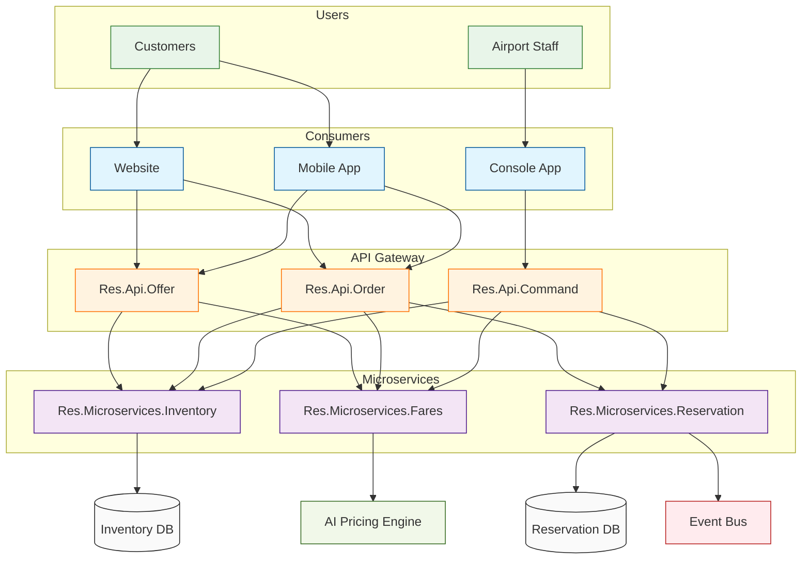

# Airline Reservation System

A comprehensive airline reservation system that provides both a traditional cryptic command interface (similar to Amadeus/Sabre) and a modern REST API. The system handles flight bookings, check-in, seat assignments, fare management, and more.

## Hisory of Airline Reservation Systems (OOMS)

Offer and Order Management Systems (OOMS) represent a fundamental shift from traditional Passenger Service Systems (PSS) in the airline industry. While PSS platforms have been the backbone of airline operations since the 1960s, beginning with systems like SABRE, they were built around rigid, standardized processes that worked well in a regulated environment where fares were filed centrally and routes were strictly controlled. These legacy systems were designed around the concept of PNRs (Passenger Name Records) and booking classes, reflecting the technology limitations and business needs of their era.

The transition to OOMS was driven by several factors including airline deregulation, the rise of low-cost carriers, growing importance of ancillary revenue, and increasing customer expectations for personalization. OMS moves away from PNR-based records to order-based management, enabling dynamic pricing, personalized offers, and continuous pricing instead of traditional booking class inventory. This shift is supported by modern technology architecture including microservices, cloud-native infrastructure, and API-first approaches that enable real-time operations and flexible integration capabilities.

The benefits of OOMS are substantial, including enhanced revenue optimization through dynamic pricing and personalized bundling, improved customer experience across channels, and increased operational efficiency. Airlines can now respond more quickly to market changes, introduce new products faster, and better manage their inventory in real-time. The technical architecture also reduces system complexity and technical debt while improving scalability and reliability.

The industry's transition to OMS began around 2015 with initial NDC (New Distribution Capability) implementation and basic offer management capabilities. This evolved through the late 2010s with enhanced dynamic pricing and full order management implementation, leading to today's advanced systems that support complete personalization and dynamic pricing. While the transformation presents challenges in terms of implementation complexity and industry-wide adoption, it represents a crucial evolution in airline retail that better serves modern customer expectations while optimizing airline revenue and operations.

## Features

- Flight search and availability
- Passenger Name Record (PNR) management
- Fare pricing and ticketing
- Seat maps and seat assignments
- Check-in and boarding pass generation
- APIS (Advanced Passenger Information System) handling
- Flight status tracking
- Payment processing

## Architecture Overview



The system follows a layered architecture pattern:

- **Client Layer**: Handles user interactions through both command-line and REST interfaces
- **API Layer**: Exposes functionality through controllers for different business domains
- **Application Layer**: Contains core business logic and service implementations
- **Domain Layer**: Defines the business entities and rules
- **Infrastructure Layer**: Manages data persistence and external service integrations

## Architecture

The solution is organized into several key projects:

### Core Projects

- **Res.Api**: REST API endpoints and controllers
- **Res.Application**: Business logic and command processing
- **Res.Core**: Core domain services and interfaces
- **Res.Domain**: Domain entities, DTOs, and enums
- **Res.Infrastructure**: Data persistence and external service integrations

### Domain Model

- **PNR**: Central booking record containing passenger, itinerary, and ticketing info
- **Inventory**: Flight schedules and seat availability
- **Fare**: Pricing rules and fare families
- **Ticket**: E-ticket records and flight coupons
- **CheckIn**: Boarding passes and passenger processing

## Command Interface

The system supports traditional airline cryptic commands. Here are some key commands:

### Availability and Booking

```
AN20JUNLHRJFK/1400    # Search flights LHR-JFK on 20JUN at 14:00
SS1Y2                 # Sell 1 seat in Y class from line 2
NM1SMITH/JOHN MR      # Add passenger name
CTCP 44123456789      # Add phone contact
CTCE TEST@EMAIL.COM   # Add email contact
ER                    # End transaction and retrieve
```

### Pricing and Ticketing

```
FXP                   # Price PNR
FS                    # Store fare
FP*CC/VISA/4444333322221111/0625/GBP100.00  # Add credit card payment
TTP                   # Issue tickets
```

### Seat Assignment

```
SM1                   # Display seat map for segment 1
ST/4A/P1/S1          # Assign seat 4A to passenger 1 segment 1
```

### Check-in

```
CKIN ABC123/P1/VS001/12A     # Check in passenger 1 on VS001, seat 12A
CKINALL ABC123/VS001         # Check in all passengers
```

## REST API

The system also provides a modern REST API:

### Authentication

```http
POST /api/command/authenticate
{
    "userId": "AGENT1",
    "password": "password123"
}
```

### Flight Search

```http
POST /api/offer/search
{
    "from": "LHR",
    "to": "JFK",
    "date": "2024-06-20",
    "currency": "GBP",
    "passengers": [
        {
            "ptc": "ADT",
            "total": 1
        }
    ]
}
```

### Create Booking

```http
POST /api/order/create
{
    "outboundOfferId": "VS001Y20JUNLHRJFK",
    "passengerCount": 1,
    "passengers": [
        {
            "title": "MR",
            "firstName": "JOHN",
            "lastName": "SMITH",
            "dateOfBirth": "1990-01-01"
        }
    ],
    "contactDetails": {
        "email": "john@example.com",
        "phone": "44123456789"
    },
    "paymentDetails": {
        "cardType": "VISA",
        "cardNumber": "4444333322221111",
        "expiry": "0625",
        "cvv": "123"
    }
}
```

### Check-in

```http
POST /api/checkin/checkin
{
    "recordLocator": "ABC123",
    "passengerId": 1,
    "flightNumber": "VS001",
    "seatNumber": "12A"
}
```

## Setup

1. Clone the repository
2. Update connection strings in `local.settings.json`
3. Install dependencies: `dotnet restore`
4. Run the application: `dotnet run`

## Development

- Built with .NET 6.0
- Uses Azure Functions for API hosting
- In-memory repositories for development (can be replaced with actual databases)
- JWT authentication for API security

## Acknowledgments

- Inspired by traditional airline reservation systems
- Uses industry-standard practices for airline data management
