## High Level Solution Design

```mermaid
graph TD
    %% Users
    Customer1[👤 Customer]
    Customer2[👤 Customer]
    Staff[👥 Airline Staff]
    OTA[👥 OTAs]
    Airlines[✈️ Other Airlines]

    %% Consumers Layer
    subgraph Consumers
        Web[Website]
        Mobile[Mobile App]
        Console[Console App]
        NDC[NDC]
    end

    %% API Layer
    subgraph Retail_APIs[Retail APIs]
        Offer[Res.Api.Offer]
        Order[Res.Api.Order]
        Delivery[Res.Api.Delivery]
    end
    subgraph Ops_APIs[Operations APIs]
        Command[Res.Api.Command]
        Interlining[Res.Api.Interlining]
    end

    %% Microservices Layer
    subgraph Microservices
        Inventory[Res.Microservices.Inventory]
        Reservation[Res.Microservices.Reservation]
        Fares[Res.Microservices.Fares]
        Customer[Res.Microservices.Customer]
        Payment[Res.Microservices.Payment]
        Seat[Res.Microservices.Seat]
    end

    %% Event Bus
    EventBus[Event Bus]

    %% Databases and External Services
    DB1[(Inventory DB)]
    DB2[(Reservation DB)]
    DB3[(Customer DB)]
    DB4[(Seat DB)]
    AI[AI Pricing Engine]
    
    %% New Components
    PaymentGateway[💳 Payment Gateway]
    RevenueAccounting[📊 Revenue Accounting System]

    %% User to Consumer connections
    Customer1 --> Web
    Customer2 --> Mobile
    Staff --> Console
    OTA --> NDC
    Airlines --> Interlining

    %% Consumer to API connections
    Web --> Offer
    Web --> Order
    Web --> Delivery
    Mobile --> Offer
    Mobile --> Order
    Mobile --> Delivery
    Console --> Command
    NDC --> Offer
    NDC --> Order

    %% API to Microservice connections
    Offer --> Inventory
    Offer --> Fares
    Offer --> Seat
    Order --> Inventory
    Order --> Reservation
    Order --> Fares
    Order --> Customer
    Order --> Payment
    Order --> Seat
    Delivery --> Inventory
    Delivery --> Reservation
    Delivery --> Seat
    Command --> Inventory
    Command --> Reservation
    Command --> Fares
    Command --> Seat
    Interlining --> Inventory
    Interlining --> Reservation
    Interlining --> Fares
    Interlining --> Seat

    %% Microservice to Database/External connections
    Inventory --> DB1
    Reservation --> DB2
    Customer --> DB3
    Seat --> DB4
    Fares --> AI
    
    %% Payment Gateway connection
    Payment --> PaymentGateway
    
    %% Event publishing
    Reservation --> EventBus
    
    %% Revenue Accounting connection
    EventBus --> RevenueAccounting

    %% Styling with black text
    classDef user fill:#e8f5e9,stroke:#2e7d32,color:black
    classDef consumer fill:#e1f5fe,stroke:#01579b,color:black
    classDef api fill:#fff3e0,stroke:#ff6f00,color:black
    classDef apiGroup fill:#f3e5f5,stroke:#4a148c,color:black
    classDef microservice fill:#fff3e0,stroke:#ff6f00,color:black
    classDef database fill:#fafafa,stroke:#212121,color:black
    classDef external fill:#f1f8e9,stroke:#33691e,color:black
    classDef eventbus fill:#ffebee,stroke:#b71c1c,color:black
    classDef payment fill:#e3f2fd,stroke:#0d47a1,color:black
    classDef revenue fill:#fff8e1,stroke:#ff8f00,color:black

    class Customer1,Customer2,Staff,OTA,Airlines user
    class Web,Mobile,Console,NDC consumer
    class Offer,Command,Order,Interlining,Delivery api
    class Retail_APIs,Ops_APIs,Microservices serviceGroup
    class Inventory,Reservation,Fares,Customer,Payment,Seat microservice
    class DB1,DB2,DB3,DB4 database
    class AI external
    class EventBus eventbus
    class PaymentGateway payment
    class RevenueAccounting revenue
```



## Flight booking

Search and Offer Phase:

Customer searches for flights via web or mobile app
Offer API checks flight availability through the Inventory microservice
Pricing options are retrieved from the Fares microservice using the AI Pricing Engine
Available flights with pricing are displayed to the customer

Order Initiation:

Customer selects flight, fare, passenger details, seat preferences, and enters payment information
Order API verifies flight availability, customer details, and pricing
Initial payment authorization is processed through Payment microservice and Payment Gateway

Reservation and Ticketing:

Upon successful authorization, Order API instructs Reservation microservice to create the PNR
Reservation microservice generates an e-ticket
Reservation microservice allocates the selected seats to the PNR through Inventory microservice

Ancillary Services (Paid Seats):

For paid seats, Reservation microservice requests additional payment processing
Order API coordinates authorization and capture with Payment microservice
Upon successful payment, Reservation microservice generates EMDs with references to the associated e-ticket

Event Publishing and Confirmation:

Reservation microservice publishes an 'OrderCreated' Cloud Event to the Event Bus
Event includes ticket and EMD details in the meta property
Event Bus forwards this to Revenue Accounting System as a one-way data feed (fire-and-forget)
Order API returns complete booking confirmation to the customer (PNR, e-ticket, EMDs)

This flow ensures proper sequencing of reservation creation, ticketing, seat allocation, and ancillary service documentation while maintaining the Order API as the central payment orchestrator.


## Check In


## IATA One Order Example Schema

```json
{
  "OrderID": "A1B2C3D4E5",
  "OrderStatus": "CONFIRMED",
  "OrderCreateDate": "2025-03-15T14:30:00Z",
  "Customer": {
    "CustomerID": "CUST123456",
    "GivenName": "Jane",
    "Surname": "Smith",
    "ContactInformation": {
      "EmailAddress": "jane.smith@example.com",
      "Phone": "+1-555-123-4567"
    },
    "LoyaltyProgram": {
      "ProgramName": "SkyMiles",
      "AccountNumber": "SM987654321",
      "Status": "Gold"
    }
  },
  "OrderItems": [
    {
      "OrderItemID": "OI-001",
      "ItemStatus": "CONFIRMED",
      "FlightItem": {
        "SegmentID": "SEG001",
        "Origin": "JFK",
        "Destination": "LHR",
        "DepartureDate": "2025-04-10T18:30:00Z",
        "ArrivalDate": "2025-04-11T07:15:00Z",
        "FlightNumber": "BA178",
        "CarrierCode": "BA",
        "ServiceClass": "J",
        "Seat": "12A",
        "Baggage": {
          "CheckedAllowance": "2PC",
          "CabinAllowance": "1PC"
        }
      }
    },
    {
      "OrderItemID": "OI-002",
      "ItemStatus": "CONFIRMED",
      "ServiceItem": {
        "ServiceID": "SRV001",
        "ServiceType": "MEAL",
        "ServiceDescription": "Special Meal - Vegetarian",
        "FlightReference": "SEG001"
      }
    },
    {
      "OrderItemID": "OI-003",
      "ItemStatus": "CONFIRMED",
      "ServiceItem": {
        "ServiceID": "SRV002",
        "ServiceType": "LOUNGE",
        "ServiceDescription": "Airport Lounge Access",
        "LocationCode": "JFK",
        "ValidityPeriod": {
          "StartDate": "2025-04-10T14:30:00Z",
          "EndDate": "2025-04-10T18:30:00Z"
        }
      }
    }
  ],
  "Payment": {
    "PaymentID": "PAY001",
    "PaymentMethod": "CreditCard",
    "PaymentStatus": "COMPLETED",
    "PaymentAmount": {
      "Amount": "1250.00",
      "CurrencyCode": "USD"
    },
    "PaymentDate": "2025-03-15T14:32:15Z"
  },
  "ServicingHistory": [
    {
      "EventID": "SRV-001",
      "EventType": "ORDER_CREATION",
      "EventTimestamp": "2025-03-15T14:30:00Z",
      "Agent": {
        "AgentID": "AGENT007",
        "AgentType": "SYSTEM"
      }
    },
    {
      "EventID": "SRV-002",
      "EventType": "SEAT_SELECTION",
      "EventTimestamp": "2025-03-15T14:35:22Z",
      "Agent": {
        "AgentID": "CUST123456",
        "AgentType": "CUSTOMER"
      }
    }
  ]
}
```

